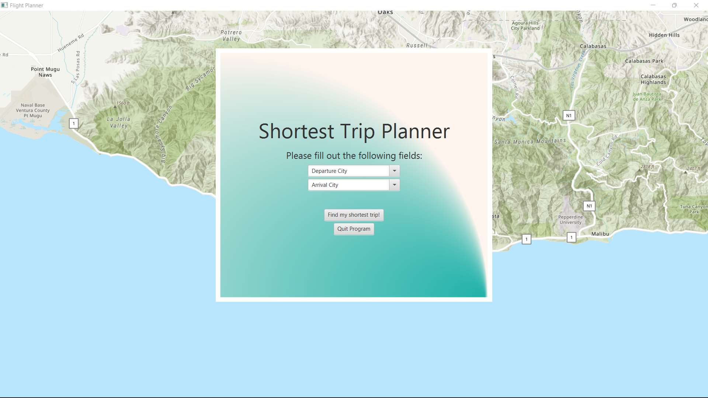

# Graphical Shortest Flight Path Project

This is a project using the ArcGIS Runtime SD for Java with Gradle. 

The project includes the Gradle wrapper, so there is no need to install Gradle to run the app.

The app launches a window displaying a map as well as a console which asks the user to
type in 2 airports. They have 10,000+ airports to choose from which are auto-completed 
as the user starts typing. Once the airports are selected and the search button is pressed,
then the whole map will be revealed as well as a blue line depicting the shortest route between
the 2 airports using Dijkstra's Algorithm. Routes between airports are chosen intuitively so flight 
paths do not travel unnecessary distances or have more than 2 layovers. Additionally, there are two 
options on the side of the screen to display the flight details or search for a new flight.

NOTE: WHEN YOU PRESS DISPLAY ROUTE ON THE AIRPORT SEARCH SCREEN SOMETIMES THE FLIGHT DETAILS THAT
SHOW UP TAB OUT AND THE MAP IS PURPOSELY LOCKED UNTIL YOU MINIMIZE THAT SCREEN. SO YOU MAY NEED TO 
ALT-TAB.

//TODO Bug: When searching for airports, when space is pressed it selects the top level airport 
from the drop-down instead of actually typing a space.

//TODO Bug: Flights cannot cross the prime meridian at the moment. So, Alaska to Russia is actually a very far flight.

** Future Plans: Currently working on transferring projects over to a web-based graphical interface
using HTML, CSS, JavaScript, REST APIs or RPC, Neo4J or/and MongoDB and the Spring Framework with a 
few extra functionalities.

## Instructions - FROM ARCGIS

### IntelliJ IDEA

1. Open IntelliJ IDEA and select _File > Open..._.
2. Choose the java-gradle-starter-project directory and click _OK_.
3. Select _File > Project Structure..._ and ensure that the Project SDK and language level are set to use Java 11.
4. Open the Gradle view with _View > Tool Windows > Gradle_.
5. In the Gradle view, double-click `copyNatives` under _Tasks > build_. This will unpack the native library dependencies to $USER_HOME/.arcgis.
6. In the Gradle view, double-click `run` under _Tasks > application_ to run the app.

### Eclipse

1. Open Eclipse and select _File > Import_.
2. In the import wizard, choose _Gradle > Existing Gradle Project_, then click _Next_.
3. Select the java-gradle-starter-project directory as the project root directory.
4. Click _Finish_ to complete the import.
5. Select _Project > Properties_ . In _Java Build Path_, ensure that under the Libraries tab, _Modulepath_ is set to JRE System Library (JavaSE-11). In _Java Compiler_, ensure that the _Use compliance from execution environment 'JavaSE-11' on the 'Java Build Path'_ checkbox is selected.
6. Right-click the project in the Project Explorer or Package Explorer and choose _Gradle > Refresh Gradle project_.
7. Open the Gradle Tasks view with _Window > Show View > Other... > Gradle > Gradle Tasks_.
8. In the Gradle Tasks view, double-click `copyNatives` under _java-gradle-starter-project > build_. This will unpack the native library dependencies to $USER_HOME/.arcgis.
9. In the Gradle Tasks view, double-click `run` under _java-gradle-starter-project > application_ to run the app.

## Requirements

See the Runtime SDK's [system requirements](https://developers.arcgis.com/java/reference/system-requirements/).
 

## Issues

Find a bug or want to request a new feature?  Please let us know by submitting an issue.
